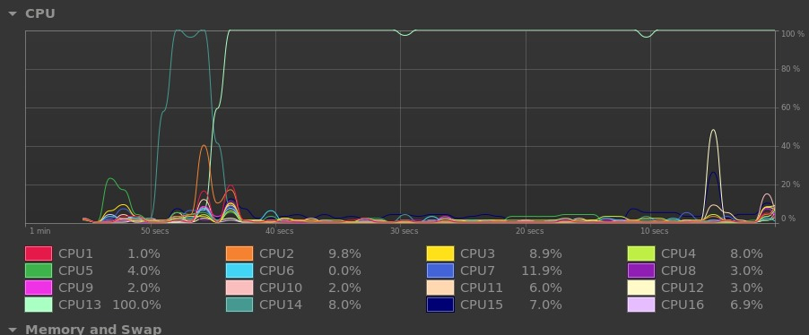
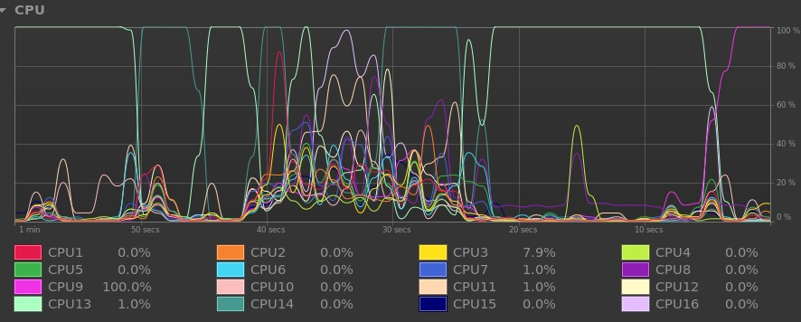
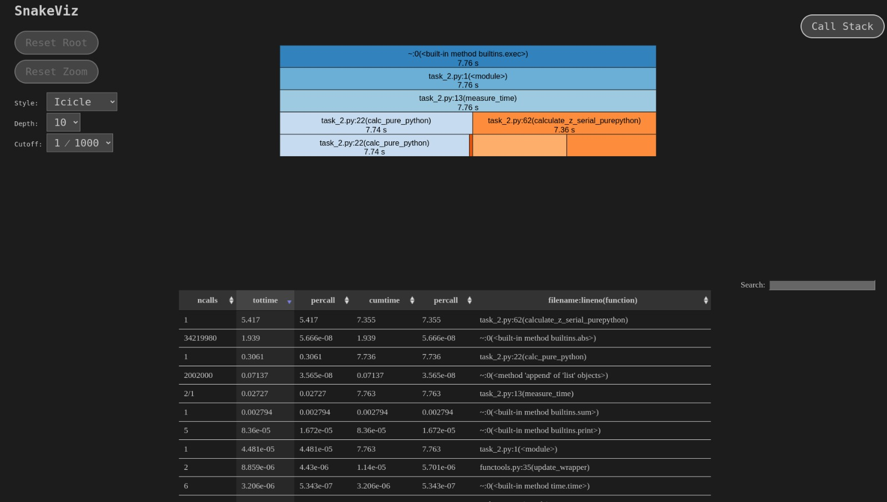
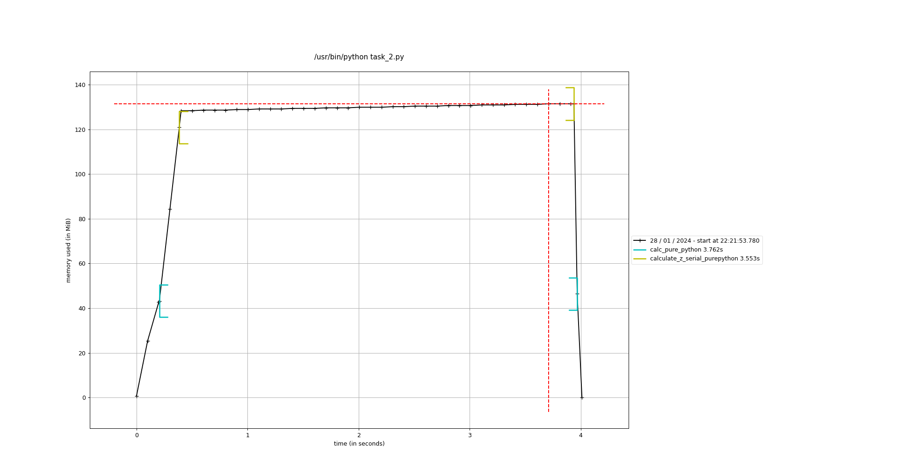
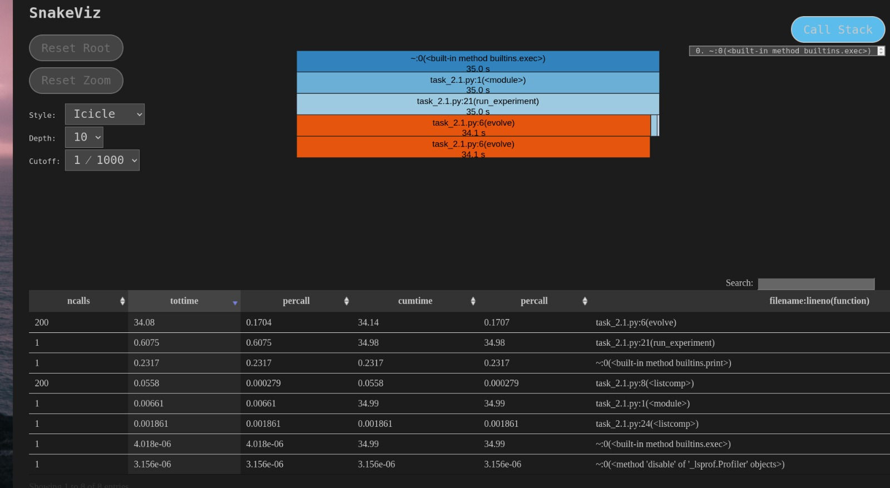
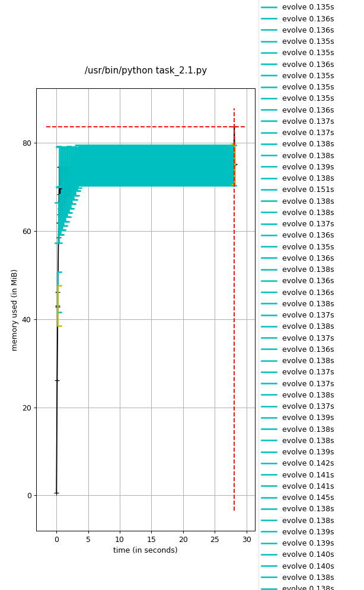

# System Specs:

* Ubuntu 22.04.3 LTS
* Linux 5.15.0-92-generic x86_64
* AMD Ryzen 7 PRO 5850U, 8c 16t
* 16 GB Ram
* 512GB SSD

# Exercise 1: Profiling the Julia Set Code

## Task 1.1 Calculate the Clock Granularity of different Python Timers 

```
Clock granularity timer_ns: 8.96e-06 [s]
Clock granularity timer_time: 8.821487426757812e-06 [s]
Clock granularity timer_timeit: 8.705999789526686e-06 [s]
```

Seems to be that the highest resolution, and thus, lowest granularity in my case is achieved with python's time module in my case (odd?).

## Task 1.2 Timing the Julia set code functions.

The basic timer decorator gives: 

```
@timefn: calculate_z_serial_purepython took 3.6345417499542236 seconds
@timefn: calc_pure_python took 3.85125732421875 seconds
```

I modified the timer decorator to also run 10 times the function, and report the average and standard deviation. Note. This means 10x10 executions of `calc_pure_python`.

```
./task_2.py
Length of x: 1000
Total elements: 1000000
@timefn: calculate_z_serial_purepython took an average of 3.661759686470032 seconds over 10 runs
Standard Deviation: 0.03295268575637416 seconds
calculate_z_serial_purepython took 36.617865562438965 seconds
Length of x: 1000
Total elements: 1000000
@timefn: calculate_z_serial_purepython took an average of 4.141640639305114 seconds over 10 runs
Standard Deviation: 0.41214350526446686 seconds
calculate_z_serial_purepython took 41.41665244102478 seconds
Length of x: 1000
Total elements: 1000000
@timefn: calculate_z_serial_purepython took an average of 3.7883469820022584 seconds over 10 runs
Standard Deviation: 0.07631285261570744 seconds
calculate_z_serial_purepython took 37.883710622787476 seconds
Length of x: 1000
Total elements: 1000000
@timefn: calculate_z_serial_purepython took an average of 3.774495768547058 seconds over 10 runs
Standard Deviation: 0.03679067606981543 seconds
calculate_z_serial_purepython took 37.74518966674805 seconds
Length of x: 1000
Total elements: 1000000
@timefn: calculate_z_serial_purepython took an average of 3.821714496612549 seconds over 10 runs
Standard Deviation: 0.027117035618528296 seconds
calculate_z_serial_purepython took 38.217379570007324 seconds
Length of x: 1000
Total elements: 1000000
@timefn: calculate_z_serial_purepython took an average of 3.782560706138611 seconds over 10 runs
Standard Deviation: 0.02418426688107579 seconds
calculate_z_serial_purepython took 37.82584810256958 seconds
Length of x: 1000
Total elements: 1000000
@timefn: calculate_z_serial_purepython took an average of 3.764856767654419 seconds over 10 runs
Standard Deviation: 0.0834382307370455 seconds
calculate_z_serial_purepython took 37.64880299568176 seconds
Length of x: 1000
Total elements: 1000000
@timefn: calculate_z_serial_purepython took an average of 3.7691503286361696 seconds over 10 runs
Standard Deviation: 0.03809792930132364 seconds
calculate_z_serial_purepython took 37.691731452941895 seconds
Length of x: 1000
Total elements: 1000000
@timefn: calculate_z_serial_purepython took an average of 3.741164135932922 seconds over 10 runs
Standard Deviation: 0.05775561913458814 seconds
calculate_z_serial_purepython took 37.41187262535095 seconds
Length of x: 1000
Total elements: 1000000
@timefn: calculate_z_serial_purepython took an average of 3.73858847618103 seconds over 10 runs
Standard Deviation: 0.04730984953215427 seconds
calculate_z_serial_purepython took 37.38612961769104 seconds
@timefn: calc_pure_python took an average of 38.221136689186096 seconds over 10 runs
Standard Deviation: 1.2750244872124656 seconds
```

It is worth noting how in the second batch of executions, we get a standard deviation of: 0.41214350526446686 seconds, and a slightly higher average time too. This is due to me running the script while doing other things in the computer, which caused the execution time to vary more than in the first batch of executions.

We can also look at the CPU graphs from my system. Note that, since my system has a lot of cores, and this program is single threaded, small disruptions do not affect the measurements a lot.




In the above image we can see how the CPU is iddle for most of the time, with some small spikes, which are probably due to small system processes.



In the above image we can see how the CPU is busy, while one thread is running the Julia set code. At the end of the image we can see that the CPU re-schedules the Julia code to run on a new thread (purple).

## Task 1.3 Profile the Julia set code with cProfile and line_profiler the computation

```
$ python -m cProfile -s cumulative task_2.py
Length of x: 1000
Total elements: 1000000
@timefn: calculate_z_serial_purepython took 7.274462699890137 seconds
calculate_z_serial_purepython took 7.274515390396118 seconds
@timefn: calc_pure_python took 7.676885366439819 seconds
         36222035 function calls (36222034 primitive calls) in 7.677 seconds

   Ordered by: cumulative time

   ncalls  tottime  percall  cumtime  percall filename:lineno(function)
        1    0.000    0.000    7.677    7.677 {built-in method builtins.exec}
        1    0.000    0.000    7.677    7.677 task_2.py:1(<module>)
      2/1    0.026    0.013    7.677    7.677 task_2.py:13(measure_time)
        1    0.300    0.300    7.650    7.650 task_2.py:23(calc_pure_python)
        1    5.344    5.344    7.274    7.274 task_2.py:62(calculate_z_serial_purepython)
 34219980    1.931    0.000    1.931    0.000 {built-in method builtins.abs}
  2002000    0.073    0.000    0.073    0.000 {method 'append' of 'list' objects}
        1    0.003    0.003    0.003    0.003 {built-in method builtins.sum}
        5    0.000    0.000    0.000    0.000 {built-in method builtins.print}
        2    0.000    0.000    0.000    0.000 task_2.py:12(timefn)
        2    0.000    0.000    0.000    0.000 functools.py:35(update_wrapper)
        6    0.000    0.000    0.000    0.000 {built-in method time.time}
       14    0.000    0.000    0.000    0.000 {built-in method builtins.getattr}
        4    0.000    0.000    0.000    0.000 {built-in method builtins.len}
        2    0.000    0.000    0.000    0.000 functools.py:65(wraps)
       10    0.000    0.000    0.000    0.000 {built-in method builtins.setattr}
        1    0.000    0.000    0.000    0.000 {method 'disable' of '_lsprof.Profiler' objects}
        2    0.000    0.000    0.000    0.000 {method 'update' of 'dict' objects}
```

```
$ python -m line_profiler task_2.py.lprof
Timer unit: 1e-06 s

Total time: 30.9746 s
File: task_2.py
Function: calc_pure_python at line 22

Line #      Hits         Time  Per Hit   % Time  Line Contents
==============================================================
    22                                           @timefn
    23                                           @profile
    24                                           def calc_pure_python(desired_width, max_iterations):
    25                                               """Create a list of complex coordinates (zs) and complex parameters (cs),
    26                                               build Julia set"""
    27         1          1.0      1.0      0.0      x_step = (x2 - x1) / desired_width
    28         1          0.2      0.2      0.0      y_step = (y1 - y2) / desired_width
    29         1          0.1      0.1      0.0      x = []
    30         1          0.1      0.1      0.0      y = []
    31         1          0.1      0.1      0.0      ycoord = y2
    32      1001        111.2      0.1      0.0      while ycoord > y1:
    33      1000        146.4      0.1      0.0          y.append(ycoord)
    34      1000        109.3      0.1      0.0          ycoord += y_step
    35         1          0.1      0.1      0.0      xcoord = x1
    36      1001        108.9      0.1      0.0      while xcoord < x2:
    37      1000        137.6      0.1      0.0          x.append(xcoord)
    38      1000        107.5      0.1      0.0          xcoord += x_step
    39                                               # build a list of coordinates and the initial condition for each cell.
    40                                               # Note that our initial condition is a constant and could easily be removed,
    41                                               # we use it to simulate a real-world scenario with several inputs to our
    42                                               # function
    43         1          0.1      0.1      0.0      zs = []
    44         1          0.1      0.1      0.0      cs = []
    45      1001         93.3      0.1      0.0      for ycoord in y:
    46   1001000      85700.3      0.1      0.3          for xcoord in x:
    47   1000000     231094.5      0.2      0.7              zs.append(complex(xcoord, ycoord))
    48   1000000     248868.8      0.2      0.8              cs.append(complex(c_real, c_imag))
    49
    50         1         37.4     37.4      0.0      print("Length of x:", len(x))
    51         1          2.9      2.9      0.0      print("Total elements:", len(zs))
    52         1          3.0      3.0      0.0      start_time = time.time()
    53         1   30405340.5    3e+07     98.2      output = calculate_z_serial_purepython(max_iterations, zs, cs)
    54         1          0.3      0.3      0.0      end_time = time.time()
    55         1          0.5      0.5      0.0      secs = end_time - start_time
    56         1          5.3      5.3      0.0      print(calculate_z_serial_purepython.__name__ + " took", secs, "seconds")
    57
    58                                               # This sum is expected for a 1000^2 grid with 300 iterations
    59                                               # It ensures that our code evolves exactly as we'd intended
    60         1       2706.8   2706.8      0.0      assert sum(output) == 33219980

Total time: 17.9506 s
File: task_2.py
Function: calculate_z_serial_purepython at line 62

Line #      Hits         Time  Per Hit   % Time  Line Contents
==============================================================
    62                                           @timefn
    63                                           @profile
    64                                           def calculate_z_serial_purepython(maxiter, zs, cs):
    65                                               """Calculate output list using Julia update rule"""
    66         1       2758.7   2758.7      0.0      output = [0] * len(zs)
    67   1000001     118688.8      0.1      0.7      for i in range(len(zs)):
    68   1000000      98751.5      0.1      0.6          n = 0
    69   1000000     131634.6      0.1      0.7          z = zs[i]
    70   1000000     110783.2      0.1      0.6          c = cs[i]
    71  34219980    7933118.2      0.2     44.2          while abs(z) < 2 and n < maxiter:
    72  33219980    5302653.9      0.2     29.5              z = z * z + c
    73  33219980    4103740.1      0.1     22.9              n += 1
    74   1000000     148454.8      0.1      0.8          output[i] = n
    75         1          0.6      0.6      0.0      return output
```


The overheads added are:

* cProfile: ~2x
  * calc_pure_python: 7.676885366439819 - 3.85125732421875 = 3.82562804222s
  * calculate_z_serial_purepython: 7.274462699890137 - 3.6345417499542236 = 3.63992094994s
* line_profiler: ~8x
  * calc_pure_python: 30.9746 - 3.85125732421875 = 27.1233426758s
  * calculate_z_serial_purepython: 17.9506 - 3.6345417499542236 = 14.31605825s




## Task 1.4 Memory-profile the Juliaset code. Use the memory_profiler and mprof to profile the computation in JuliaSet code
 
```
$ python -m memory_profiler task_2.py
Length of x: 1000
Total elements: 1000000

@timefn: calculate_z_serial_purepython took 3323.492999315262 seconds
calculate_z_serial_purepython took 3323.4931185245514 seconds
@timefn: calc_pure_python took 3420.925241947174 seconds
Filename: task_2.py

Line #    Mem usage    Increment  Occurrences   Line Contents
=============================================================
    22   43.629 MiB   43.629 MiB           1   @timefn
    23                                         @profile
    24                                         def calc_pure_python(desired_width, max_iterations):
    25                                             """Create a list of complex coordinates (zs) and complex parameters (cs),
    26                                             build Julia set"""
    27   43.629 MiB    0.000 MiB           1       x_step = (x2 - x1) / desired_width
    28   43.629 MiB    0.000 MiB           1       y_step = (y1 - y2) / desired_width
    29   43.629 MiB    0.000 MiB           1       x = []
    30   43.629 MiB    0.000 MiB           1       y = []
    31   43.629 MiB    0.000 MiB           1       ycoord = y2
    32   43.629 MiB    0.000 MiB        1001       while ycoord > y1:
    33   43.629 MiB    0.000 MiB        1000           y.append(ycoord)
    34   43.629 MiB    0.000 MiB        1000           ycoord += y_step
    35   43.629 MiB    0.000 MiB           1       xcoord = x1
    36   43.629 MiB    0.000 MiB        1001       while xcoord < x2:
    37   43.629 MiB    0.000 MiB        1000           x.append(xcoord)
    38   43.629 MiB    0.000 MiB        1000           xcoord += x_step
    39                                             # build a list of coordinates and the initial condition for each cell.
    40                                             # Note that our initial condition is a constant and could easily be removed,
    41                                             # we use it to simulate a real-world scenario with several inputs to our
    42                                             # function
    43   43.629 MiB    0.000 MiB           1       zs = []
    44   43.629 MiB    0.000 MiB           1       cs = []
    45  121.312 MiB   -9.262 MiB        1001       for ycoord in y:
    46  121.312 MiB -9664.922 MiB     1001000           for xcoord in x:
    47  121.312 MiB -9661.355 MiB     1000000               zs.append(complex(xcoord, ycoord))
    48  121.312 MiB -9615.996 MiB     1000000               cs.append(complex(c_real, c_imag))
    49
    50  121.312 MiB    0.000 MiB           1       print("Length of x:", len(x))
    51  121.312 MiB    0.000 MiB           1       print("Total elements:", len(zs))
    52  121.312 MiB    0.000 MiB           1       start_time = time.time()
    53  131.859 MiB  131.859 MiB           1       output = calculate_z_serial_purepython(max_iterations, zs, cs)
    54  131.859 MiB    0.000 MiB           1       end_time = time.time()
    55  131.859 MiB    0.000 MiB           1       secs = end_time - start_time
    56  131.859 MiB    0.000 MiB           1       print(calculate_z_serial_purepython.__name__ + " took", secs, "seconds")
    57
    58                                             # This sum is expected for a 1000^2 grid with 300 iterations
    59                                             # It ensures that our code evolves exactly as we'd intended
    60  131.859 MiB    0.000 MiB           1       assert sum(output) == 33219980


Filename: task_2.py

Line #    Mem usage    Increment  Occurrences   Line Contents
=============================================================
    62  121.312 MiB  121.312 MiB           1   @timefn
    63                                         @profile
    64                                         def calculate_z_serial_purepython(maxiter, zs, cs):
    65                                             """Calculate output list using Julia update rule"""
    66  128.789 MiB    7.477 MiB           1       output = [0] * len(zs)
    67  131.859 MiB    0.000 MiB     1000001       for i in range(len(zs)):
    68  131.859 MiB    0.000 MiB     1000000           n = 0
    69  131.859 MiB    0.000 MiB     1000000           z = zs[i]
    70  131.859 MiB    0.000 MiB     1000000           c = cs[i]
    71  131.859 MiB    3.070 MiB    34219980           while abs(z) < 2 and n < maxiter:
    72  131.859 MiB    0.000 MiB    33219980               z = z * z + c
    73  131.859 MiB    0.000 MiB    33219980               n += 1
    74  131.859 MiB    0.000 MiB     1000000           output[i] = n
    75  131.859 MiB    0.000 MiB           1       return output
```

```
$ python -m mprof run task_2.1.py
mprof.py: Sampling memory every 0.1s
running new process
running as a Python program...
Length of x: 1000
Total elements: 1000000
@timefn: calculate_z_serial_purepython took 3.619373321533203 seconds
calculate_z_serial_purepython took 3.6194193363189697 seconds
@timefn: calc_pure_python took 3.820849895477295 seconds
```

Complete results can be found in the repo as `mprofile_1.4.dat`



The overheads added are:

* memory_profiler: ~900x
  * calc_pure_python: 3420.925241947174  - 3.85125732421875  = 3417.07398462
  * calculate_z_serial_purepython: 3323.492999315262  - 3.6345417499542236 = 3319.85845757
* mprof: ~1x
  * calc_pure_python: 3.820849895477295 - 3.85125732421875  = -0.03040742874
  * calculate_z_serial_purepython: 3.619373321533203 - 3.6345417499542236 = -0.01516842842  

# Exercise 2: Parallelizing the Julia Set Code

## Task 2.1 Profile the diffusion code with cProfile and line_profiler the computation. Use the cProfile and line_profiler to profile the computation.
```
$ python -m cProfile -s cumulative task_2.1.py
         406 function calls in 36.190 seconds

   Ordered by: cumulative time

   ncalls  tottime  percall  cumtime  percall filename:lineno(function)
        1    0.000    0.000   36.190   36.190 {built-in method builtins.exec}
        1    0.007    0.007   36.190   36.190 task_2.1.py:1(<module>)
        1    0.554    0.554   36.183   36.183 task_2.1.py:21(run_experiment)
      200   35.352    0.177   35.399    0.177 task_2.1.py:7(evolve)
        1    0.229    0.229    0.229    0.229 {built-in method builtins.print}
      200    0.047    0.000    0.047    0.000 task_2.1.py:9(<listcomp>)
        1    0.001    0.001    0.001    0.001 task_2.1.py:24(<listcomp>)
        1    0.000    0.000    0.000    0.000 {method 'disable' of '_lsprof.Profiler' objects}
```

```
$ python -m line_profiler task_2.1.py.lprof
Timer unit: 1e-06 s

Total time: 115.73 s
File: task_2.1.py
Function: evolve at line 5

Line #      Hits         Time  Per Hit   % Time  Line Contents
==============================================================
     5                                           @profile
     6                                           def evolve(grid, dt, D=1.0):
     7       200        224.8      1.1      0.0      xmax, ymax = grid_shape
     8       200      61722.5    308.6      0.1      new_grid = [[0.0] * ymax for x in range(xmax)]
     9    128200      14934.9      0.1      0.0      for i in range(xmax):
    10  82048000    8152558.1      0.1      7.0          for j in range(ymax):
    11  81920000    7865661.4      0.1      6.8              grid_xx = (
    12  81920000   33466780.1      0.4     28.9                  grid[(i + 1) % xmax][j] + grid[(i - 1) % xmax][j] - 2.0 * grid[i][j]
    13                                                       )
    14  81920000    7353410.8      0.1      6.4              grid_yy = (
    15  81920000   34091297.9      0.4     29.5                  grid[i][(j + 1) % ymax] + grid[i][(j - 1) % ymax] - 2.0 * grid[i][j]
    16                                                       )
    17  81920000   24723475.0      0.3     21.4              new_grid[i][j] = grid[i][j] + D * (grid_xx + grid_yy) * dt
    18       200         85.2      0.4      0.0      return new_grid

Total time: 174.65 s
File: task_2.1.py
Function: run_experiment at line 20

Line #      Hits         Time  Per Hit   % Time  Line Contents
==============================================================
    20                                           @profile
    21                                           def run_experiment(num_iterations):
    22                                               # Setting up initial conditions
    23         1          0.6      0.6      0.0      xmax, ymax = grid_shape
    24         1       1231.1   1231.1      0.0      grid = [[0.0] * ymax for x in range(xmax)]
    25
    26                                               # These initial conditions are simulating a drop of dye in the middle of our
    27                                               # simulated region
    28         1          0.9      0.9      0.0      block_low = int(grid_shape[0] * 0.4)
    29         1          0.4      0.4      0.0      block_high = int(grid_shape[0] * 0.5)
    30        65          6.8      0.1      0.0      for i in range(block_low, block_high):
    31      4160        387.6      0.1      0.0          for j in range(block_low, block_high):
    32      4096        516.9      0.1      0.0              grid[i][j] = 0.005
    33
    34                                               # Evolve the initial conditions
    35       201        124.8      0.6      0.0      for i in range(num_iterations):
    36       200  174448607.4 872243.0     99.9          grid = evolve(grid, 0.1)
    37
    38         1     198951.8 198951.8      0.1      print(grid)
```


## Task 2.2 Memory-profile the diffusion code. Use the memory_profiler and mprof to profile the computation. 

```
Filename: task_2.1.py

Line #    Mem usage    Increment  Occurrences   Line Contents
=============================================================
     5   75.312 MiB 14898.391 MiB         200   @profile
     6                                         def evolve(grid, dt, D=1.0):
     7   75.312 MiB  -10.281 MiB         200       xmax, ymax = grid_shape
     8   75.312 MiB -6607.750 MiB      128600       new_grid = [[0.0] * ymax for x in range(xmax)]
     9   75.508 MiB -75651.590 MiB      128200       for i in range(xmax):
    10   75.508 MiB -48523411.773 MiB    82048000           for j in range(ymax):
    11   75.508 MiB -48447628.238 MiB    81920000               grid_xx = (
    12   75.508 MiB -48447770.465 MiB    81920000                   grid[(i + 1) % xmax][j] + grid[(i - 1) % xmax][j] - 2.0 * grid[i][j]
    13                                                     )
    14   75.508 MiB -48447653.906 MiB    81920000               grid_yy = (
    15   75.508 MiB -48447653.906 MiB    81920000                   grid[i][(j + 1) % ymax] + grid[i][(j - 1) % ymax] - 2.0 * grid[i][j]
    16                                                     )
    17   75.508 MiB -48447653.906 MiB    81920000               new_grid[i][j] = grid[i][j] + D * (grid_xx + grid_yy) * dt
    18   75.508 MiB  -36.816 MiB         200       return new_grid


Filename: task_2.1.py

Line #    Mem usage    Increment  Occurrences   Line Contents
=============================================================
    20   43.652 MiB   43.652 MiB           1   @profile
    21                                         def run_experiment(num_iterations):
    22                                             # Setting up initial conditions
    23   43.652 MiB    0.000 MiB           1       xmax, ymax = grid_shape
    24   46.746 MiB    3.094 MiB         643       grid = [[0.0] * ymax for x in range(xmax)]
    25
    26                                             # These initial conditions are simulating a drop of dye in the middle of our
    27                                             # simulated region
    28   46.746 MiB    0.000 MiB           1       block_low = int(grid_shape[0] * 0.4)
    29   46.746 MiB    0.000 MiB           1       block_high = int(grid_shape[0] * 0.5)
    30   46.746 MiB    0.000 MiB          65       for i in range(block_low, block_high):
    31   46.746 MiB    0.000 MiB        4160           for j in range(block_low, block_high):
    32   46.746 MiB    0.000 MiB        4096               grid[i][j] = 0.005
    33
    34                                             # Evolve the initial conditions
    35   75.312 MiB  -10.281 MiB         201       for i in range(num_iterations):
    36   75.312 MiB 14926.957 MiB         200           grid = evolve(grid, 0.1)
    37
    38   75.527 MiB    0.215 MiB           1       print(grid)

```

```
$ python -m mprof run task_2.1.py
mprof.py: Sampling memory every 0.1s
running new process
running as a Python program...
```

Complete results can be found in the repo as `mprofile_2.2.dat`


